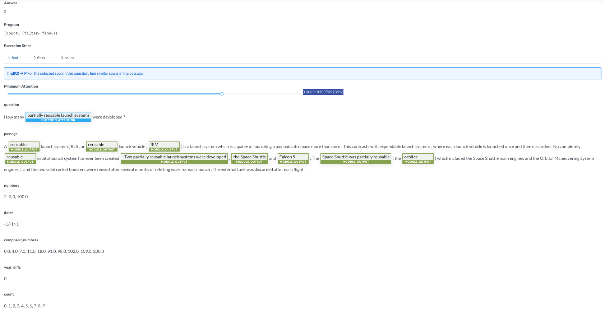

### This repository correspons to the COMP6248-Reproducability-Challenge (2019-2020), and the reproduction report to the NMN-Drop for reasoning over the text.

#### Based on the work of <Gupta, N., Lin, K., Roth, D., Singh, S. and Gardner, M., 2019. Neural Module Networks for Reasoning over Text. arXiv preprint arXiv:1912.04971.>

#### Zhongxin Xie*, Ming Xiong, Siyuan Liu

#### Department of Electronic and Computer Science 

#### University of Southampton

#### Southampton, England SO17 1BJ

#### E-mail: (zx4a19, mx2n19, sl18n19) @soton.ac.uk

```

# Environment: 
# BN: Python version has to be >3.6 and<3.7
Linux Ubuntu 16.04LTS
Python 3.6.7

# The allennlp v0.9.0 has to and can only be installed by downloading from the their github release history to the local.
wget https://github.com/allenai/allennlp/archive/v0.9.0.tar.gz
unzip v0.9.0.tar.gz
pip install ./allennlp

# The allennlp-semparsr has to and can only be installed by downloading from the their github release history to the local.
git clone https://github.com/allenai/allennlp-semparse.git
pip install ./allennlp-semparse

# Other dependencies.
pip install torch==1.5.0+cu101 torchvision==0.6.0+cu101 -f https://download.pytorch.org/whl/torch_stable.html
pip install dateparser==0.7.2
pip install spacy==2.2.0
python -m spacy download en_core_web_lg

# Clone code and make symlinks
git clone https://github.com/SylvanLiu/COMP6248-Reproducability-Challenge-NMN-Drop-for-Reasoning-Over-Text.git
cd COMP6248-Reproducability-Challenge-NMN-Drop-for-Reasoning-Over-Text/
# Train can be achieved in two different method:
allennlp train drop parser bert.jsonnet –include-package semQA -s ./iclr cameraready/iclr drop data
# Or
bash train.sh

# Predict:
bash predict.sh
#Or
allennlp predict --output-file ${PREDICTION_FILE} \
                 --predictor ${PREDICTOR} \
                 --cuda-device ${GPU} \
                 --include-package ${INCLUDE_PACKAGE} \
                 --silent \
                 --batch-size 4 \
                 --use-dataset-reader \
                 --overrides "{"model": { "beam_size": ${BEAMSIZE}, "debug": ${DEBUG}}}" \
                 ${MODEL_TAR} ${VALDATA_FILE}

# Evaluate:
evaluate.sh
#Or
allennlp evaluate --output-file ${VAL_METRICS_FILE} \
                  --cuda-device ${GPU} \
                  --overrides "{"model": {"cuda_device": ${GPU} }}" \
                  --include-package ${INCLUDE_PACKAGE} \
                  ${MODEL_TAR} ${VALDATA_FILE}
```

Shown below is a demo, and from my point of view, it can perform perfectly on the questions to the most of English-skills reading tests.

Question: How many partially reusable launch systemswere developed?

Text: A reusable launch system (RLS, or reusable launch vehicle, RLV) is a launch system which is capable of launching a payload into space more than once. This contrasts with expendable launch systems, where each launch vehicle is launched once and then discarded. No completely reusable orbital launch system has ever been created. Two partially reusable launch systems were developed, the Space Shuttle and Falcon 9. The Space Shuttle was partially reusable: the orbiter (which included the Space Shuttle main engines and the Orbital Maneuvering System engines), and the two solid rocket boosters were reused after several months of refitting work for each launch. The external tank was discarded after each flight.
Predict(Attention = 0.00691830970918936): 


